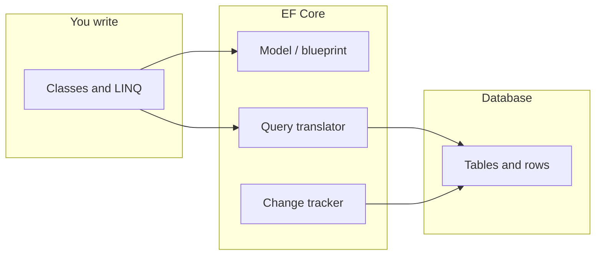

# Entity Framework Core — learn it as a story, not a manual

This folder is for **building a mental model**: who does what, **in what order**, and **why** that design exists. It is **not** a replacement for the official docs—use [Microsoft’s EF Core overview](https://learn.microsoft.com/en-us/ef/core/) when you need API details—but the goal here is **easy language** and **connections between ideas**.

## The one diagram to keep in your head

Think of your app talking to SQL in three layers:

- **Your C# classes** are the world you want to work in.
- **The model** is EF’s internal “map” from those classes to tables and columns.
- **LINQ** is a *wish list* until you run something like `ToListAsync`; then EF turns that wish list into **real SQL**.
- **The change tracker** remembers what you loaded or added so **`SaveChanges`** knows what to write back.

Everything else in this series is **zooming in** on that picture.

## How to read this series

| Order | File | In plain words |
|------:|------|----------------|
| 1 | [01-overview-the-model-and-dbcontext.md](./01-overview-the-model-and-dbcontext.md) | What is `DbContext`? What is `DbSet`? Why options in the constructor? |
| 2 | [02-startup-build-and-database-initialization.md](./02-startup-build-and-database-initialization.md) | From `Program.cs` to first DB touch: scopes, `CanConnect`, `EnsureCreated` |
| 3 | [03-aspnet-core-di-and-request-lifecycle.md](./03-aspnet-core-di-and-request-lifecycle.md) | Why **one new context per HTTP request** |
| 4 | [04-query-execution-from-linq-to-results.md](./04-query-execution-from-linq-to-results.md) | From `.Where(...)` to rows in memory |
| 5 | [05-change-tracking-and-savechanges.md](./05-change-tracking-and-savechanges.md) | Editing objects and pressing “commit” |
| 6 | [06-model-building-fluent-api-and-ddl.md](./06-model-building-fluent-api-and-ddl.md) | How C# configuration becomes table shapes |
| 7 | [07-migrations-vs-ensurecreated-production-guidance.md](./07-migrations-vs-ensurecreated-production-guidance.md) | “Create once” vs “evolve over time” |
| 8 | [08-glossary-and-faq.md](./08-glossary-and-faq.md) | Quick definitions and short answers |

**Suggested path:** read 1 → 3 → 4 → 5 first if you mainly care about web APIs; add 2 and 6 when you care about startup and schema; finish with 7 and 8.

## Optional images

Notebook scans or diagrams can live under [images/](./images/) and you can link them from these files for your own notes.

## Versions

Ideas here apply across recent EF Core versions; match your **NuGet EF Core packages** to your **.NET** version in real projects.
